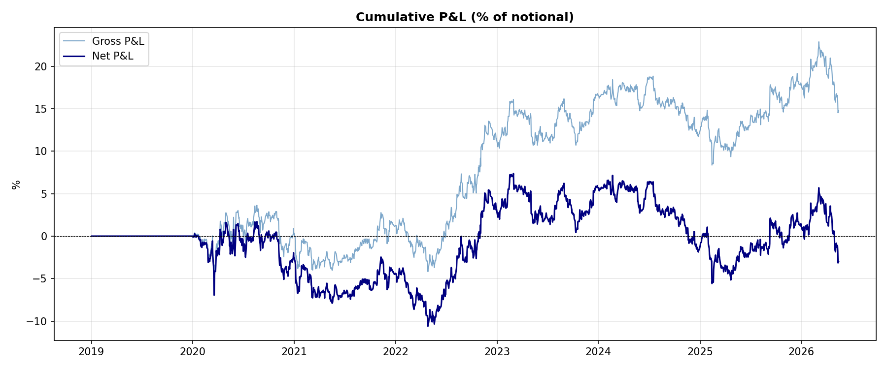
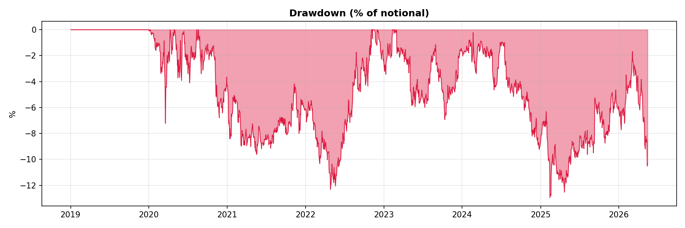
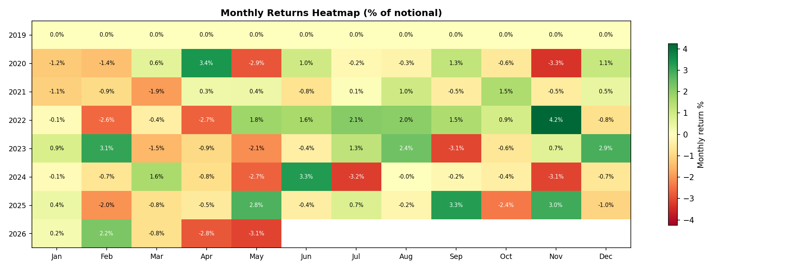
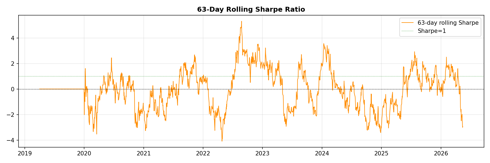
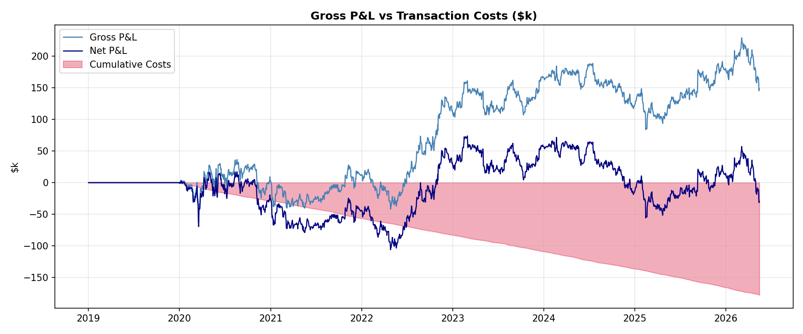
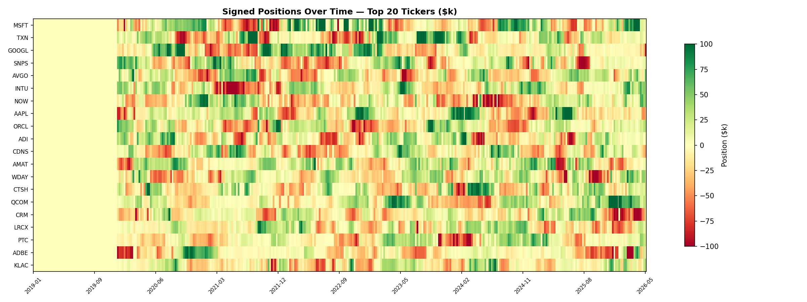

# OU Stat-Arb — PCA / Ledoit-Wolf Statistical Arbitrage System

A fully self-contained, walk-forward **statistical arbitrage backtester** built on an Ornstein-Uhlenbeck (OU) mean-reversion model applied to a universe of **50 US tech stocks** (2019 – present).

The system strips out common factor exposure with a rolling PCA + Ledoit-Wolf covariance model, fits OU processes to the resulting idiosyncratic residuals, and trades dollar-neutral / factor-neutral portfolios sized by mean-reversion z-scores.

---

## Strategy Overview

### 1. Factor Model (`factors.py`)

Each rebalance, a rolling 252-day window of log-returns is used to fit a PCA factor model with Ledoit-Wolf shrinkage:

1. Standardise returns to zero mean, unit variance.
2. Compute Ledoit-Wolf shrunk covariance matrix Σ (N×N).
3. Eigendecompose Σ and retain the top-k factors explaining ≥ 55% of variance.
4. Extract **idiosyncratic residuals** E = R − B·F (in log-return units).

This removes market-wide and sector-level co-movement, leaving only each stock's idiosyncratic "spread" to be traded.

### 2. Signal Generation (`signals.py`)

Each asset's cumulative residual spread is modelled as an OU process via AR(1) OLS:

```
Δe_t = a + b·e_{t−1} + ε_t
```

Parameters extracted:
| Parameter | Formula |
|---|---|
| Mean-reversion speed | κ = −b / dt |
| Long-run mean | μ = −a / b |
| Equilibrium vol | σ_eq = std(ε) / √(2κ·dt) |
| Half-life | log(2) / κ (days) |

Only assets with **5 ≤ half-life ≤ 40 days** are traded. Z-scores are computed as:

```
z_t = (e_t − μ) / σ_eq
```

**Thresholds:** Entry |z| ≥ 2.0 · Exit |z| ≤ 0.5 · Stop-loss |z| ≥ 4.0

### 3. Portfolio Construction (`portfolio.py`)

Positions are sized by the OU vol-scaled inverse z-score, then made:
- **Dollar-neutral:** w ← w − mean(w)
- **Factor-neutral:** w ← w − B·(BᵀB)⁻¹·Bᵀ·w (removes residual factor bets)
- **Scaled** to target gross notional ($1M default)
- **Capped** at 10% of notional per position

### 4. Backtester (`backtest.py`)

Walk-forward simulation with:
- **Rebalance every 5 trading days** (full model refit + position rebuild)
- **Daily stop-loss checks** between rebalances using the current fitted model
- **Anti-lookahead bias:** positions decided on day t are applied from day t+1

**Transaction costs modelled:**
| Cost | Value |
|---|---|
| Per-share commission | $0.005 / share each way |
| Market impact | 10 bps of notional traded |
| Short borrow | 25 bps / year on short exposure |

---

## Backtest Results

**Universe:** 50 US tech stocks · **Period:** 2019-01-02 → 2026-05-15 (7.4 years) · **Notional:** $1M

```
══════════════════════════════════════════════════════════════
  OU STAT-ARB (PCA-LW) — BACKTEST TEARSHEET
══════════════════════════════════════════════════════════════
  Period          : 2019-01-02  →  2026-05-15  (7.3 yr)
  Universe        : 50 US tech stocks
  Notional        : $1,000,000

  ─── RETURNS ────────────────────────────────────────────
  Ann. Return (net)  :  -0.41%
  Ann. Return (gross): +2.01%
  Ann. Volatility    :  6.89%

  ─── RISK-ADJUSTED ──────────────────────────────────────
  Sharpe (net)    : -0.059
  Sharpe (gross)  :  0.292
  Sortino (net)   : -0.080
  Max Drawdown    : -12.95%
  Calmar Ratio    : -0.031

  ─── P&L SUMMARY ────────────────────────────────────────
  Total Gross P&L :  $  148,105
  Total Costs     :  $  178,055
  Total Net P&L   :  $  -29,950
  Cost drag       :  242.1 bps / yr

  ─── TRADING ACTIVITY ───────────────────────────────────
  Avg Daily Turnover : 8.70% of notional
  Avg Gross Exposure : $851,043
  Win Rate (daily)   : 42.2%
══════════════════════════════════════════════════════════════
```

**Key finding:** Gross Sharpe of 0.29 confirms the OU signal carries real alpha — the strategy is profitable before costs. Transaction costs of 242 bps/yr (driven by 8.7% daily turnover at a 5-day rebalance frequency) fully absorb the edge. Reducing rebalance frequency or tightening position sizing would significantly improve net performance.

### Charts

| Equity Curve | Drawdown |
|:---:|:---:|
|  |  |

| Monthly Returns Heatmap | Rolling Sharpe |
|:---:|:---:|
|  |  |

| Cost Breakdown | Position Heatmap |
|:---:|:---:|
|  |  |

---

## Project Structure

```
.
├── main.py          # CLI entrypoint
├── data.py          # Download, clean, cache price data (yfinance → Parquet)
├── factors.py       # Rolling PCA + Ledoit-Wolf factor model
├── signals.py       # OU process fitting and z-score generation
├── portfolio.py     # Dollar-neutral, factor-neutral portfolio construction
├── backtest.py      # Walk-forward event-driven backtester
├── report.py        # Performance metrics, charts, tearsheet
├── requirements.txt
└── results/
    ├── summary.py               # Print comprehensive metrics summary
    ├── metrics.json             # Full metrics dict (auto-generated)
    ├── tearsheet.txt            # One-page tearsheet (auto-generated)
    ├── 00_equity_curve.png
    ├── 01_drawdown.png
    ├── 02_monthly_returns_heatmap.png
    ├── 03_rolling_sharpe.png
    ├── 04_cost_breakdown.png
    └── 05_positions_heatmap.png
```

---

## Setup

```bash
git clone https://github.com/FlameVirgo/ou-stat-arb.git
cd ou-stat-arb

python -m venv .venv
source .venv/bin/activate        # Windows: .venv\Scripts\activate
pip install -r requirements.txt
```

---

## Usage

```bash
# Download fresh data and run full backtest (~30–60s)
python main.py

# Use cached parquet files (faster, no network)
python main.py --skip-download

# Custom notional
python main.py --notional 500000 --skip-download

# Verbose (DEBUG-level) logging
python main.py --skip-download -v

# Print comprehensive metrics summary after a run
python results/summary.py
```

All outputs are written to `results/`.

---

## Universe

50 large-cap US technology stocks across semis, software, cloud, and internet:

`NVDA AAPL MSFT GOOGL META AVGO AMD ORCL QCOM TXN NOW INTU AMAT LRCX SNPS CDNS KLAC ADI MRVL CRM PANW CRWD ADBE NFLX SHOP UBER INTC HPQ DELL FTNT NET DDOG WDAY TTD ZS TEAM HUBS MDB OKTA PATH SNOW RBLX DUOL MNDY ANSS PTC EPAM CTSH PSTG ARM`

Data is sourced from Yahoo Finance via [yfinance](https://github.com/ranaroussi/yfinance). Tickers with > 5% missing observations are dropped; remaining gaps are forward/back-filled up to 3 consecutive days.

---

## Parameters

| Parameter | Value | File |
|---|---|---|
| Rolling window | 252 trading days | `factors.py` |
| PCA variance threshold | 55% | `factors.py` |
| Rebalance frequency | Every 5 trading days | `backtest.py` |
| OU half-life filter | 5 – 40 days | `signals.py` |
| Entry z-score | ±2.0 | `signals.py` |
| Exit z-score | ±0.5 | `signals.py` |
| Stop-loss z-score | ±4.0 | `signals.py` |
| Target notional | $1,000,000 | `portfolio.py` |
| Max position size | 10% of notional | `portfolio.py` |
| Per-share commission | $0.005 | `backtest.py` |
| Market impact | 10 bps | `backtest.py` |
| Short borrow cost | 25 bps / year | `backtest.py` |

---

## Dependencies

- [numpy](https://numpy.org/) / [pandas](https://pandas.pydata.org/) — core numerics
- [yfinance](https://github.com/ranaroussi/yfinance) — market data
- [scikit-learn](https://scikit-learn.org/) — Ledoit-Wolf covariance estimator
- [matplotlib](https://matplotlib.org/) — charts
- [pyarrow](https://arrow.apache.org/docs/python/) — Parquet I/O

---

## License

MIT
